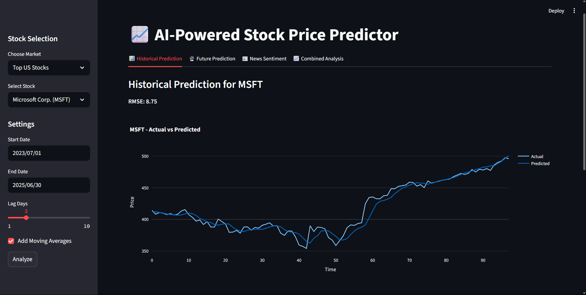

# AI-Powered Stock Price Predictor

Predict future stock prices using LSTM neural networks and visualize results with an interactive Streamlit web app.

## Features
- Fetches historical stock data using yfinance
- Preprocesses data (missing values, normalization, lag features, moving averages)
- LSTM model with 2 layers for time series prediction
- Interactive web UI with Streamlit and Plotly
- RMSE evaluation and actual vs predicted plots

## Model Summary
- 2 LSTM layers (50 units each, dropout 0.2)
- Dense output layer
- Compiled with Adam optimizer and MSE loss

## Usage
- Enter a stock ticker (e.g., AAPL)
- Select date range and options
- Click Predict to view results

## Screenshots

*Future Scope: Add news sentiment analysis and future prediction features!* 
